<div align="center">

# Stream Composer

**Many streams in. Curated channels out.**

Point any number of OBS instances at one server, drop the ones you want into
a channel, and viewers get a live grid that lays itself out, composed
entirely in the browser, sub-second latency, no server-side encoding at all.

[](https://github.com/Slicit/stream-composer/actions/workflows/ci.yml)
[](LICENSE)

<br>

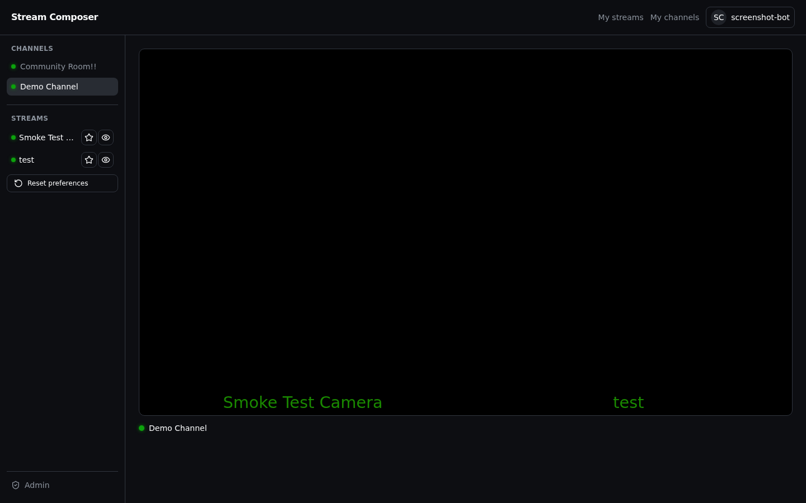

</div>

---

> v2.0.0 is a rewrite of the original single-container Node app into three
> services: a Go data plane, a Rails control plane, and a React frontend.
> Still want the old single-container release? `install.sh` and the
> `v1.5.0` tag are still here.

## Install

```bash
curl -fsSL https://raw.githubusercontent.com/Slicit/stream-composer/main/install-go-rails-react.sh | bash
```

Unlike the old installer, this one never builds anything: it fetches two
compose files and a MediaMTX config, then pulls pre-built images from GHCR.
A fresh install or an upgrade is seconds of network I/O. Re-running it later
upgrades in place, keeping `.env`.

Non-interactive:

```bash
curl -fsSL https://raw.githubusercontent.com/Slicit/stream-composer/main/install-go-rails-react.sh | bash -s -- \
  --yes --domain stream.example.com --email you@example.com \
  --admin-password 'a-good-password' --master-key "$(cat rails-service/config/master.key)"
```

To update an existing install, re-run the same installer from inside its
directory, or:

```bash
curl -fsSL https://raw.githubusercontent.com/Slicit/stream-composer/main/update-go-rails-react.sh | bash
```

Then open the admin console, create a stream, and paste the key into OBS.
Create a channel to curate which streams show up together on their own page.

**Self-registration needs SMTP to actually deliver confirmation emails.**
The installer doesn't prompt for this — without it, self-registration
still works end to end, but the confirmation link only ever shows up in
`docker compose logs rails`, never a real inbox. Set `SMTP_ADDRESS`,
`SMTP_PORT`, `SMTP_USERNAME`, `SMTP_PASSWORD`, `SMTP_DOMAIN` and
`MAIL_FROM` in `.env` (any provider — Mailgun, SES, a personal relay,
etc.; see `.env.go-rails-react.example`'s own comments for the exact
shape), then restart the `rails` service.

## What it does

- **Composes in the browser, not the server.** Each source is a separate
  WebRTC (WHEP) session; the browser lays the grid out and decodes every
  tile itself. No ffmpeg compositor, no extra server CPU per viewer or per
  channel.
- **Channels.** A named, sluggable, curated list of streams at its own URL
  (`/c/your-channel`). Public or private, with per-channel access grants,
  an optional background image, and one channel can be set as the site's
  homepage. Give it a description, a current topic, and a featured game,
  and edit all of it — including which layout mode it uses — from its own
  full edit page.
- **Two grid layouts.** Fixed locks a 16:9 canvas that scales with the
  page — the original behavior. Maximize instead fits the grid to
  whatever space is actually available, always leaving room for the
  title and description. Pick a site-wide default in Admin → Settings, or
  override it per channel.
- **Games.** Tag a channel with what's being played. Admin → Games
  manages the list, seeded with 100+ common titles to start from.
- **Per-stream visibility.** Streams are private by default; make one
  public, or share it with specific users. A private stream inside a
  channel you can otherwise see renders as a locked placeholder, never a
  playable tile.
- **Favorites, in the left nav.** The Streams panel under Channels lets a
  viewer star sources to keep, hide the rest, and reset back to "show
  everything" in one click. Entirely client-side, never touches the server.
- **Live, at a glance.** Channels and streams fade to green in the left nav
  the moment they go live, no polling the page to find out. A channel is
  live if any of its members are.
- **Audio stays with its source.** The grid is silent by default; picking a
  tile unmutes just that one.
- **Restream anywhere.** Forward any incoming source to Twitch, YouTube, or
  any RTMP endpoint, as many destinations per source as you like, each
  switched on independently. Nothing is re-encoded.
- **Restream a whole channel, composed.** Opt-in, for accounts an admin
  grants it to: an actual server-side ffmpeg compositor (the one thing the
  browser-only design above deliberately doesn't do) flattens a channel's
  on-air sources into a single feed — horizontal, vertical, or both at
  once — and relays it out, so you can go live on YouTube or TikTok with
  the same multi-cam grid viewers see here. Runs as its own service, only
  while it's actually needed (an enabled composition, a live member, an
  enabled destination), so it never costs anything when it's off.
- **Self-registration, with 2FA.** Anyone can create their own account —
  always a viewer, restricted to public channels — confirmed by email
  before they can sign in. Two-factor authentication (TOTP, any
  authenticator app) is opt-in from account settings; an admin can force-
  reset it to unlock someone who's locked themselves out.
- **Admin impersonation.** See the app exactly as another user does, with a
  fixed banner naming who you're impersonating and a one-click way back.
- **Server & Stats.** CPU, memory, host and data-plane uptime, MediaMTX and
  relay health, and a real (not demo) bandwidth history chart with hover
  detail, 15-minute samples kept for 7 days.
- **Managed from the browser.** Users, stream keys, restream destinations,
  channels and server health all live in one admin console.

## A look around

**The viewer** picks up whichever channel it's pointed at (or the
configured homepage channel); the left nav lists every channel you can see,
with a live dot, and your favorited streams below it.

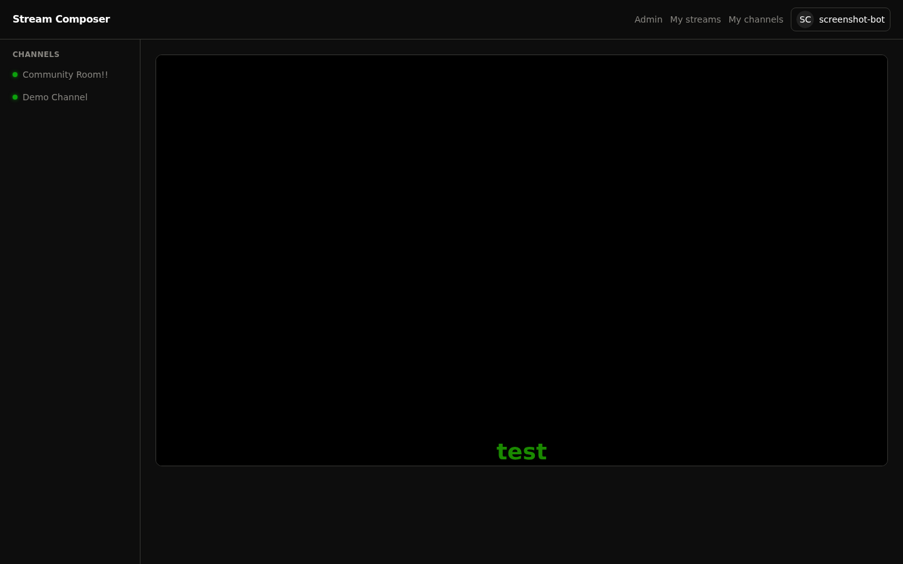

**A channel page** groups a curated set of streams under its own slug.
Members you can't access render as a locked placeholder instead of a tile;
everyone else's just play.


**"Maximize" layout mode** fits the grid to the streams themselves instead
of a locked canvas, packing tiles into whatever space the page actually
has while keeping the title and description visible below it.

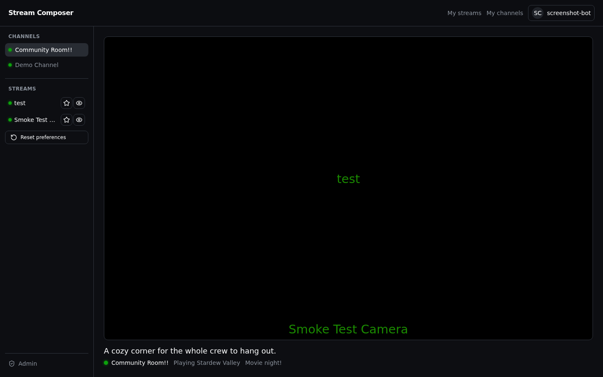

**Admin → Users** is where accounts and roles live, including the
impersonate action on each row (only available to admins).

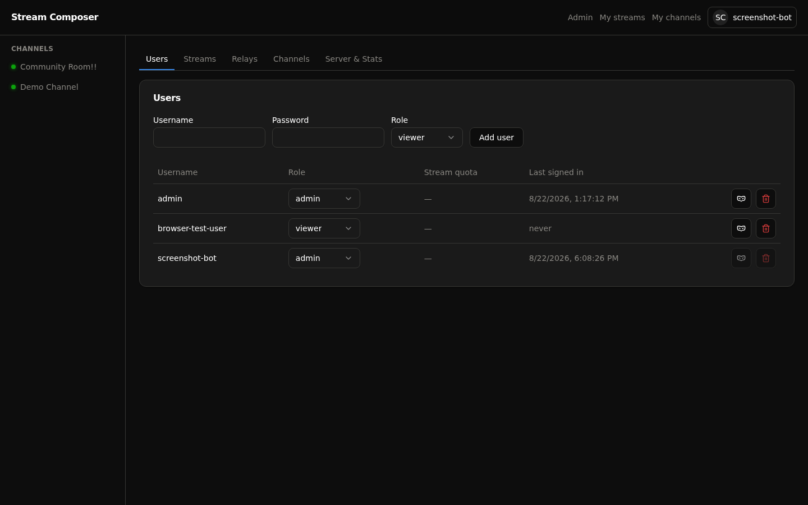

**Admin → Streams** is where keys and visibility live. Keys stay masked
until you copy them; visibility (private/public) is a dropdown per row.

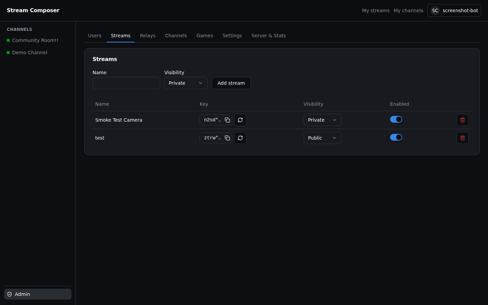

**Admin → Relays** forwards individual sources to other platforms. Pick a
source, pick a destination (or paste any RTMP URL), and switch it on.

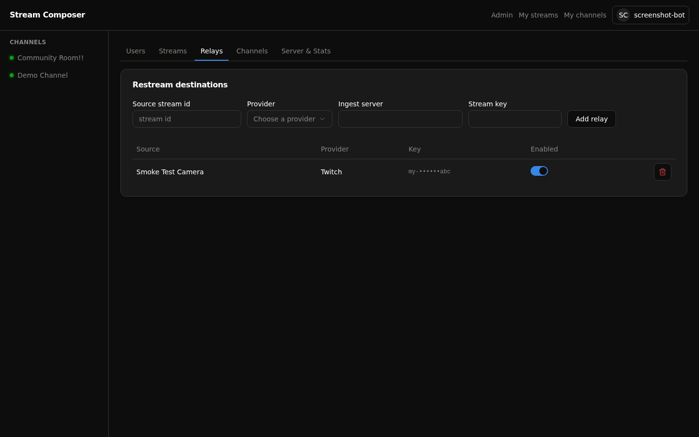

**Admin → Channels** is where curated stream lists get built and made
public, private, or shared with specific users.

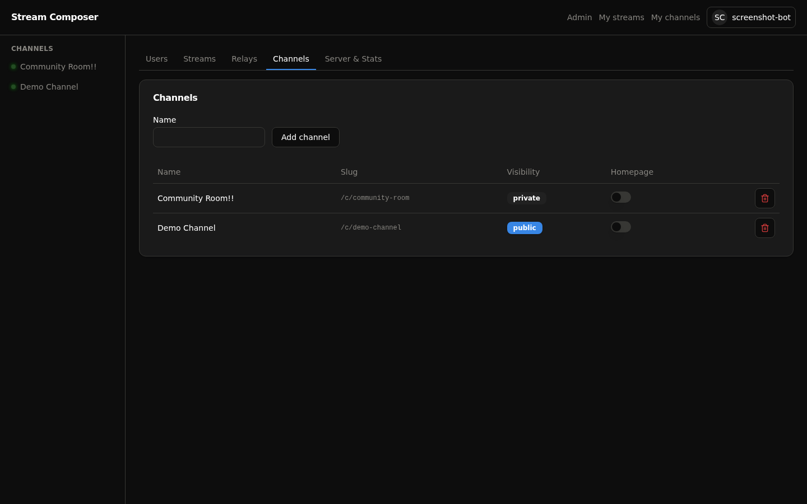

**A channel's full edit page** (opened from either Admin → Channels or a
user's own "My channels") covers everything about it in one place: name,
slug, description, topic, featured game, visibility, grid layout mode,
owner, member streams, and its background image.

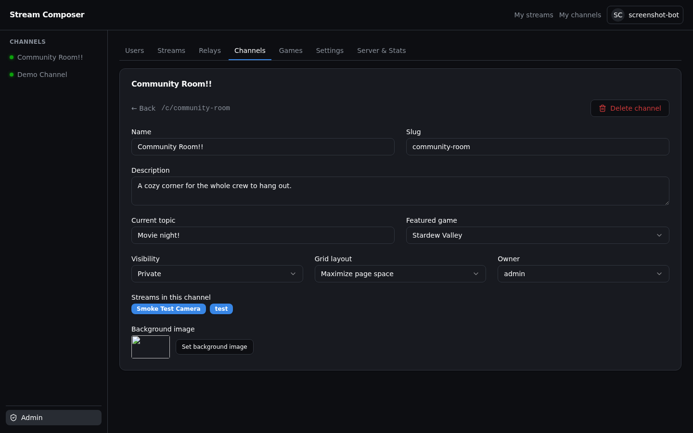

**Admin → Games** manages the list channels pick their featured game from.

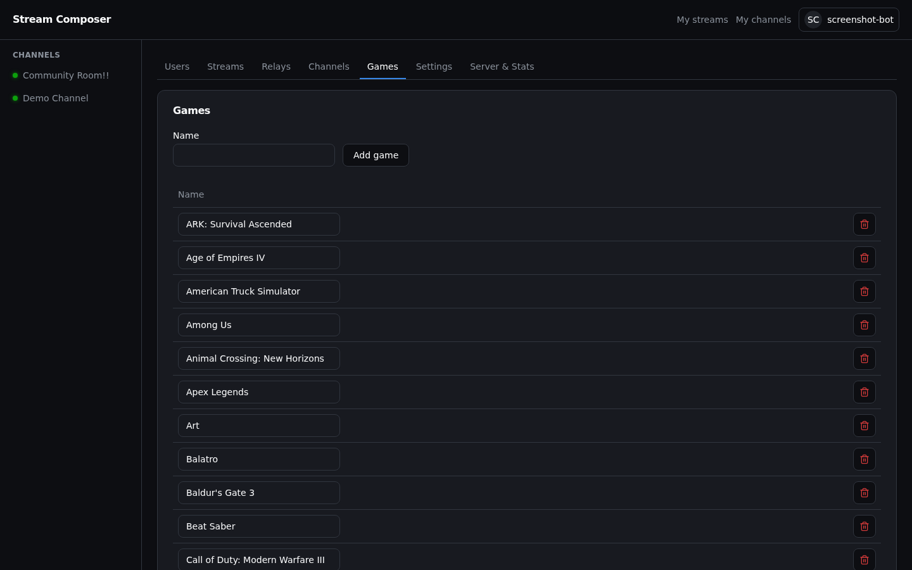

**Admin → Settings** holds the site-wide defaults: which grid layout new
channels start with, and whether anonymous viewing is allowed at all.

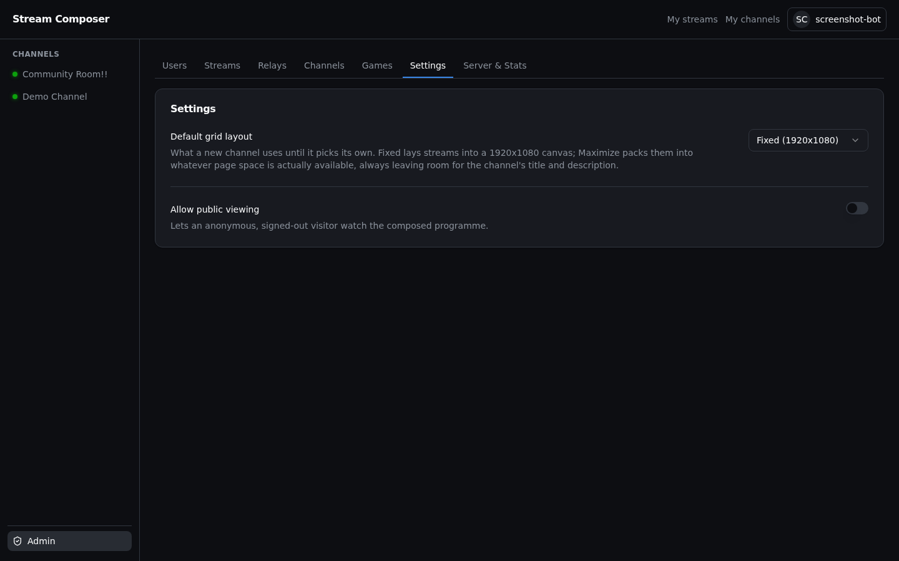

**Admin → Server & Stats** shows what the box is actually doing: CPU,
memory, uptime, service health, and a real bandwidth chart you can hover
for the exact value at any point.

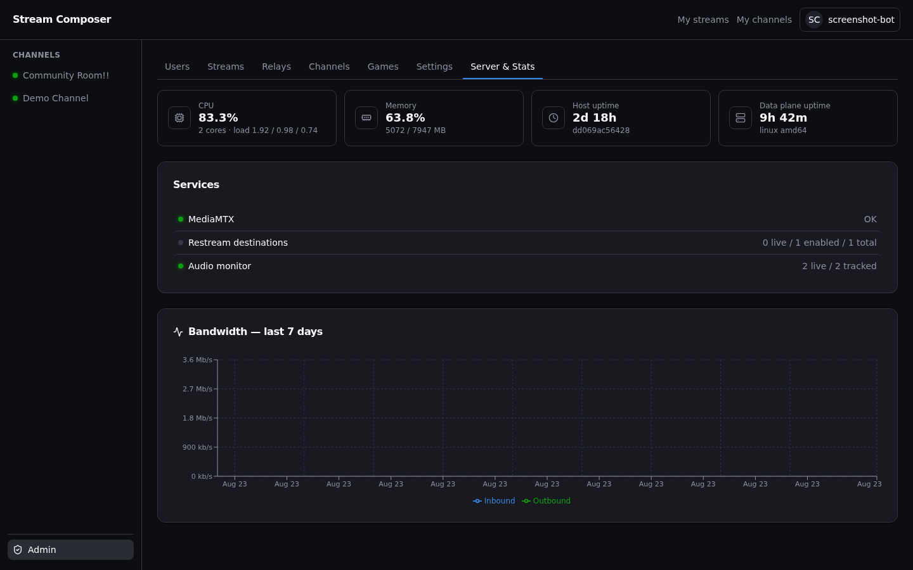

## How it fits together

```
  OBS  ──RTMP/SRT──┐
  OBS  ──RTMP/SRT──┼──▶  MediaMTX  ──WHEP (per source)──▶  Browser
  OBS  ──RTMP/SRT──┘      (ingest,                          (composes the
                           packaging)                        grid itself)
                              ▲
                              │ auth hook
                              │
                         Go data plane  ◀──WHEP proxy, channel/live state──▶  Browser
                              │
                              │ users, sessions, channel/stream config
                              ▼
                       Rails control plane  ◀──▶  Postgres
                              ▲
                              │
                            React (Vite dev proxy / built assets in prod)
```

Every source stays a separate WHEP session all the way to the browser;
there is no server-side compositor to route media through. The Go data
plane owns MediaMTX's auth hook, proxies playback, and tracks live/bandwidth
state. Rails owns users, sessions, and the channel/stream/relay
configuration that both the data plane and the React app read. Traefik
terminates TLS in production; only the ingest ports and the WebRTC media
port are exposed publicly.

## Getting a stream on air

1. **Admin → Streams → Add stream.** Name it, and a key is generated.
2. In OBS: *Settings → Stream → Service: Custom*, server `rtmp://<host>/live`,
   paste the key, **Start Streaming**.
3. Open the viewer or a channel containing that stream. It appears within a
   couple of seconds.

Recommended OBS output for a 720p source: 1280x720, 30 fps, 2500 to
4000 kb/s, keyframe interval 2s, x264 `veryfast`, profile `high`, tune
`zerolatency`, B-frames off (WebRTC can't play B-frames; the admin console
flags a source that has them).

## Everyday commands

```bash
cd /opt/stream-composer          # or wherever install-go-rails-react.sh put it

docker compose ps                             # what is running
docker compose logs -f                        # container logs
docker compose pull && docker compose up -d   # upgrade images only
./update-go-rails-react.sh                    # upgrade, redownloading compose/config too
```

## Documentation

| Document | What is in it |
|---|---|
| [docs/OBS.md](docs/OBS.md) | Connecting OBS, encoder settings, the helper script |
| [docs/screenshots/](docs/screenshots/) | Every screen shown above, and the script that recaptures them |

`docs/ARCHITECTURE.md`, `docs/CONFIGURATION.md`, `docs/PERFORMANCE.md` and
`docs/TROUBLESHOOTING.md` still describe the pre-migration, single-container
app (in particular, the server-side ffmpeg compositor this branch no longer
has) and haven't been brought forward yet, so they're deliberately left out
of the table above until they are.

## Development

This branch runs as three services against Postgres, not one process
against a JSON file. The dev compose file (`docker-compose.migration.yml`)
runs all of it, prefixed `scmig-` and on its own ports, so it can sit next
to an existing install or an unrelated project on the same host:

```bash
git clone https://github.com/Slicit/stream-composer.git
cd stream-composer

MEDIAMTX_PUBLIC_HOST=<your box's LAN/public IP> \
  docker compose -f docker-compose.migration.yml up -d --build
```

`MEDIAMTX_PUBLIC_HOST` matters even for local work: without it, WebRTC
signaling succeeds but ICE has nothing reachable to connect to, and nothing
actually plays in a real browser.

```bash
cd go-service && go build ./... && go vet ./... && go test ./...
cd rails-service && bundle exec rspec
cd react-app && npm test
```

`scripts/screenshots/capture.mjs` drives Playwright against an already
running dev stack to recapture every image in `docs/screenshots/`; see the
comment at the top of that file for usage.

## Licence

MIT, see [LICENSE](LICENSE).

Built on [MediaMTX](https://github.com/bluenviron/mediamtx),
[Rails](https://rubyonrails.org/), [React](https://react.dev/) and
[Traefik](https://traefik.io/).
