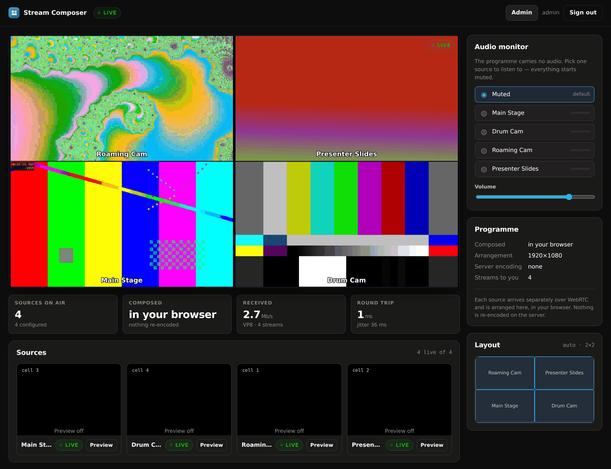
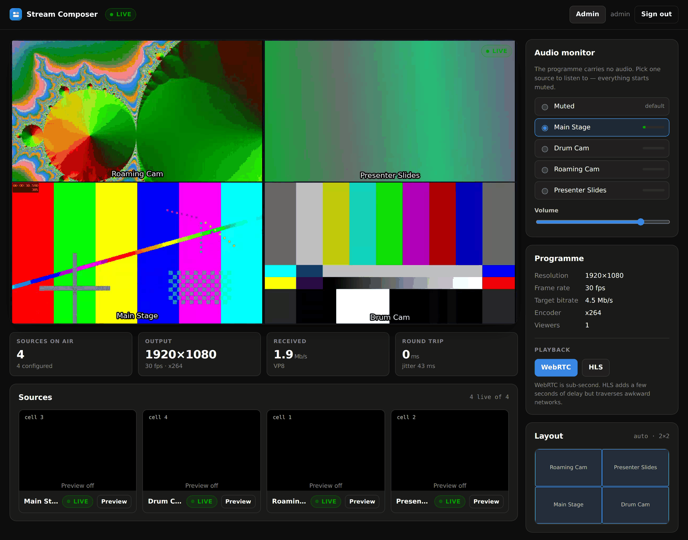

# Architecture

## The pieces

```
                    ┌──────────────────────────────────────────────┐
   OBS ──RTMP:1935──▶│                                              │
   OBS ──RTMP:1935──▶│                  MediaMTX                    │
   OBS ───SRT:8890──▶│   ingest · packaging · WebRTC · HLS · RTSP   │
                    └───▲───────────────┬──────────────────────▲────┘
                        │               │ RTSP (read sources)  │ RTSP
          auth decision │               ▼                      │ (publish programme)
                        │      ┌────────────────────┐           │
                    ┌───┴──────┤  ffmpeg compositor ├───────────┘
                    │          └────────────────────┘
                    │                   ▲ supervised by
   ┌────────────────┴───────────────────┴───────────────────────────┐
   │                    Stream Composer (Node.js)                    │
   │  web UI · REST API · sessions · stream keys · layout engine     │
   │  ffmpeg supervisor · media proxy · rotating logs                │
   └────────────────────────────▲────────────────────────────────────┘
                                │ HTTPS
                          ┌─────┴──────┐
                          │   Traefik  │  TLS termination, Let's Encrypt
                          └─────▲──────┘
                                │
                            Browsers
```

Three containers. MediaMTX handles the protocols, the composer holds all the
product logic, Traefik handles certificates.

## The compositing loop

Every two seconds the composer asks MediaMTX which paths are publishing, and
builds a signature from the live source set plus the composition settings. When
that signature changes:

1. **Wait for it to settle** (1.5 s by default). OBS reconnects and brief network
   hiccups would otherwise restart the encoder repeatedly.
2. **Compute the layout** — pixel rectangles for N sources on the canvas.
3. **Build the filtergraph** from those rectangles.
4. **Stop the old ffmpeg, start the new one.**

If ffmpeg exits unexpectedly the supervisor restarts it with exponential backoff
(2 s, doubling to 15 s), resetting once a run stays healthy.

### Why `overlay` rather than `xstack`

`xstack` tiles a perfect matrix and nothing else. `overlay` onto a solid colour
source costs about the same and buys arbitrary rectangles — which is what makes
centred partial rows, gutters and the spotlight layout possible from one code
path. Nine sources become nine `overlay` filters chained onto a `color` source.

### Why RTSP internally

Sources are read from MediaMTX over RTSP rather than RTMP: no FLV container
constraints, lower overhead, and it is MediaMTX's native internal transport. The
composed programme is published back the same way.

### Frame rate before scale

Each input chain is `fps → scale → pad → drawtext`. Normalising the frame rate
first means a frame that is about to be dropped is never scaled. On a CPU-only
box scaling is the second largest cost after the encoder, so the ordering is
worth the thought.

## Where the grid is made

Composition happens in one of two places, chosen in **Admin → Composition**.

**On the server** (`mode: server`, the default) is what the diagram above shows:
ffmpeg reads every source, draws the grid and publishes one programme. Viewers
get a single stream whatever the source count, the sources themselves never
leave the internal network, and HLS is available as a fallback. The cost is a
continuous encode — the same whether one person is watching or a thousand, or
nobody at all.

**In the browser** (`mode: web`) starts no encoder. The server still decides
what is on air and works out the layout, and hands the player the cells it would
have encoded; the player subscribes to each source over WHEP and positions them
into those cells. The arrangement is computed by the same `planLayout()` both
modes use, so the two look alike — the captions the encoder would have burnt in
are drawn as text with the same white-on-black-outline treatment.



|                          | On the server | In the browser |
|---|---|---|
| Server CPU               | one continuous encode | none |
| Streams per viewer       | 1 | one per source |
| Bandwidth to each viewer | the programme bitrate | the sum of the sources |
| Latency                  | ingest → encode → play | ingest → play |
| HLS fallback             | yes | no |
| Recording or restreaming the programme | yes | there is no programme |
| Sources reachable by viewers | optional | necessarily |

One practical wrinkle belongs with that table. Browsers refuse H.264 containing
B-frames over WebRTC, and OBS emits them unless told otherwise — so a source
that is perfectly happy feeding the encoder may be unplayable directly. The
server probes each publishing source once with ffprobe, records the verdict, and
either plays that cell over HLS instead (the default, badged, a couple of
seconds behind) or leaves it empty with an explanation. Server composition never
meets this, because ffmpeg re-encodes.

That last row is the one to think about before switching. "Show individual
sources to viewers" hides the sources behind the programme; in web mode the
sources *are* what the player composes, so the setting cannot apply — the proxy
serves them (still only via opaque playback ids, still authenticated, still
never the ingest key).

Web mode suits a small, trusted audience on a good network, or a server with no
CPU headroom to spare. Server mode suits everything else, and is the only one
that produces a single programme stream you can record or hand to one URL.

Neither choice affects restreaming: that forwards the *sources*, and works the
same in both modes.

## Restreaming

Forwarding an incoming source on to Twitch, YouTube or anything else that
accepts an RTMP publish. Configured per destination in **Admin → Restream**, and
independent of everything above: one source can go to any number of platforms,
each switched on and off on its own.

```
   OBS ──▶ MediaMTX  ──RTSP──▶ ffmpeg (remux, -c copy) ──RTMP──▶ Twitch
   live/abc              │                                 └───▶ YouTube
                         └──RTSP──▶ compositor / browser  ──────▶ viewers here
```

The forwarder is a supervised ffmpeg per destination doing a straight remux:
RTSP in, FLV out, no filtergraph and no video encode. The cost is a socket and a
memcpy — nowhere near the cost of the compositor — so adding platforms scales
with bandwidth rather than with cores.

Four things are worth knowing:

- **A relay follows its source.** Nothing runs while the source is not
  publishing; when OBS reconnects, forwarding resumes on the next poll. That is
  not treated as a failure and earns no backoff.
- **Failures back off per destination**, doubling from the restart delay to the
  maximum. A rejected stream key fails instantly and permanently, and without
  this it would mean an ffmpeg spawned every two seconds indefinitely.
- **Audio is copied by default.** RTMP can only carry AAC, which is what OBS
  publishes, so nothing is re-encoded. A source arriving as something else gets
  a per-destination *re-encode to AAC* option — the only transcode this path
  will ever do, at roughly one percent of a core.
- **Third-party stream keys are treated as credentials.** They are stored in the
  config file with everything else, never returned by the destination list (only
  a masked form), scrubbed out of ffmpeg's stderr before it reaches the log, and
  sent in the clear only when an administrator asks for one explicitly.

Deleting a stream deletes its destinations with it. Leaving them behind would
keep publishing to a platform on behalf of an ingest slot that has since been
handed to somebody else.

## Audio

**The composed programme carries no audio at all.** This is deliberate.

Mixing several live sources into one track gives you every room's noise at once —
unusable for monitoring, and the wrong default for anything else. Instead, audio
stays with its original stream, and the player subscribes to whichever one the
viewer selects, one at a time, over an audio-only WebRTC session. Everything
starts muted.

Two useful side effects: no AAC encode in the programme pipeline (a few percent
of CPU back), and switching what you are listening to costs nothing on the
server.



## Security model

**Nothing reaches MediaMTX from the internet except media.** Published ports:

| Port | Protocol | Why |
|---|---|---|
| 80, 443 | HTTP/HTTPS | Traefik: the web interface and playback signalling |
| 1935 | RTMP | Ingest from OBS |
| 1936 | RTMPS | Ingest, TLS-terminated by Traefik (TLS overlay only) |
| 8890/udp | SRT | Ingest |
| 8189/udp | WebRTC | Media. Required for playback from outside the host |

MediaMTX's API (9997), RTSP (8554), HLS (8888) and WHEP (8889) listeners stay on
the internal Docker network.

**Playback is proxied and authenticated.** Browsers never talk to MediaMTX
directly. WHEP and HLS requests go to the composer, which checks the session
cookie, resolves the requested playback id, and only then forwards. One
hostname, one certificate, one place where access is decided.

Four rules in the proxy each exist because the obvious version was exploitable:

1. **Viewers address streams by an opaque playback id, never by the ingest
   key.** The key is a publishing credential; handing it to a browser would let
   any viewer publish into the grid. Redirects from MediaMTX are rewritten so
   the internal path cannot leak through a `Location` header either.
2. **The forwarded URL is rebuilt from validated components.** Validating the
   raw path and then letting `new URL()` build the upstream request meant the
   checked path and the forwarded path could differ — `%2e%2e` reached
   arbitrary MediaMTX paths.
3. **Only playback verbs are routed.** WHIP is a *publish* verb; routing it
   behind view access let a viewer take over a camera slot. `GET` on the WebRTC
   mount is refused too, because it reaches MediaMTX's built-in publish page.
4. **The client's `Authorization` header is stripped**, and the internal
   credential is attached by the proxy itself. Forwarding it turned a
   container-internal password into an internet-facing one with unlimited
   guesses.

**Reads require the internal credential.** It is tempting to let the auth hook
approve any read of a known path on the grounds that playback only arrives
through the authenticated proxy. That reasoning is wrong: MediaMTX's RTMP and
SRT listeners are internet-facing and serve *reads* as well as publishes, so
`ffmpeg -i rtmp://host/program` walked straight past viewer authentication.
Reads are now allowed only for the compositor and the proxy, which present the
internal credential; the proxy adds it on the viewer's behalf after checking the
session.

**The auth hook URL carries a shared secret.** A source-address check is not
enough on its own: behind Traefik every request reaches the composer from the
container network, so "is this caller internal?" is unanswerable from the socket
address alone. The secret travels only on the internal network, never to a
browser. Without it the endpoint was an unauthenticated oracle for testing
whether a stream key is valid.

**Publishing is authenticated by stream key.** MediaMTX delegates every
publish/read decision to the composer over HTTP, so a new key works immediately
and a revoked key disconnects its publisher on the spot. The key in the OBS
"Stream Key" field *is* the credential — the same model every streaming platform
uses, and the reason OBS setup is two fields.

**Sessions** are stateless signed cookies (HMAC-SHA256, `HttpOnly`, `SameSite=Lax`,
`Secure` under TLS). Passwords are hashed with scrypt and a per-user salt. Sign-in
attempts are rate limited per address — and `trust proxy` is off unless
`TRUST_PROXY` names a hop count, because trusting `X-Forwarded-For`
unconditionally lets any client invent its own address and walk past that limit.

**The internal hook endpoint** (`/internal/*`) refuses any request that does not
come from a private address.

## Storage

One JSON file, `/data/config.json`, holding users, stream keys, restream
destinations, composition settings and the session secret. Written atomically
(temp file, rename), mode 0600.

Keys the file has never seen are filled in from the defaults on load, so a
backup taken before a feature existed restores cleanly — that is how an older
configuration acquires an empty destination list rather than crashing the relay
supervisor.

A stream server holds a handful of users and keys. A database would mean a native
dependency, migrations and a bigger image, in exchange for nothing at this scale.
Back it up by copying one file — `make backup` does exactly that.

## Logging

Two channels under `/data/logs`, both rotated by size:

- `server.log` — application events at the configured level
- `ffmpeg.log` — raw encoder output, including the exact command line for each run

Rotation keeps `maxFiles` generations of `maxSizeMb` each, so worst-case disk use
is bounded and predictable (20 MB × 5 = 100 MB per channel by default). Both
limits are adjustable in **Admin → Server → Settings** and take effect
immediately.

Docker's own capture of container stdout is separately capped in
`docker-compose.yml` (`DOCKER_LOG_MAX_SIZE`, `DOCKER_LOG_MAX_FILES`), because an
unbounded json-file driver is the classic way to fill a disk.

## Layout engine

`server/src/layout.js` is pure and unit-tested — no ffmpeg, no I/O. Given a source
count and a canvas it returns rectangles, guaranteed to be even-numbered (H.264
chroma subsampling requires it), inside the canvas, and non-overlapping. The test
suite asserts those three properties across 1–24 sources, five layouts and four
canvas sizes.

Because the engine is separate, the same rectangles drive the ffmpeg filtergraph,
the live layout diagram in the viewer, and the layout preview in the admin
console. They cannot drift apart.

## Choices worth knowing about

| Decision | Reasoning |
|---|---|
| One runtime dependency (`express`) | Small image, fast builds, little to patch. Logging, sessions, hashing, proxying and the store are all standard library. |
| JSON file, not a database | Handful of records; atomic writes; trivial backup. |
| Alpine + system ffmpeg | ~250 MB image against ~400 MB for Debian, and Alpine's ffmpeg has the filters this needs. |
| Non-root at runtime | The entrypoint fixes volume ownership, then drops to `node`. |
| Two compose overlays | Plain HTTP and TLS deployments differ only in published ports and Traefik. `COMPOSE_FILE` in `.env` selects the pair, so `docker compose up -d` always does the right thing. |
| hls.js vendored, not from a CDN | Installations on networks without outbound internet still work. |
