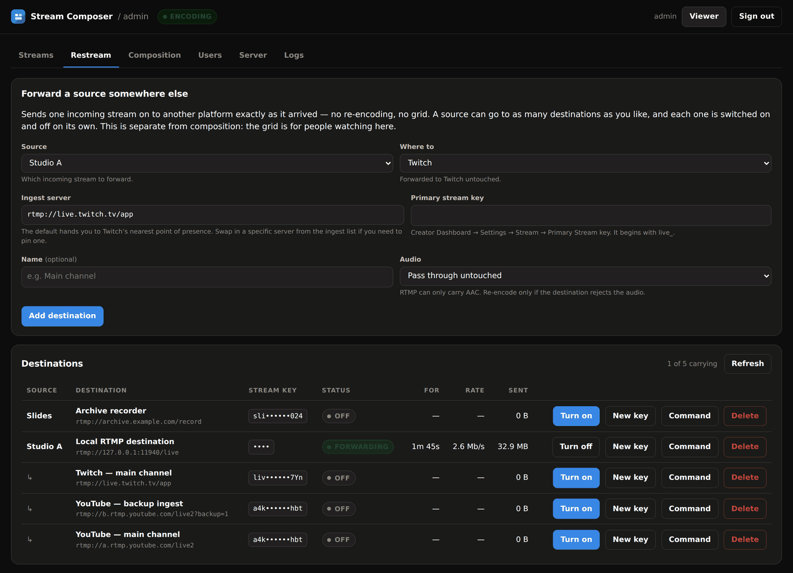
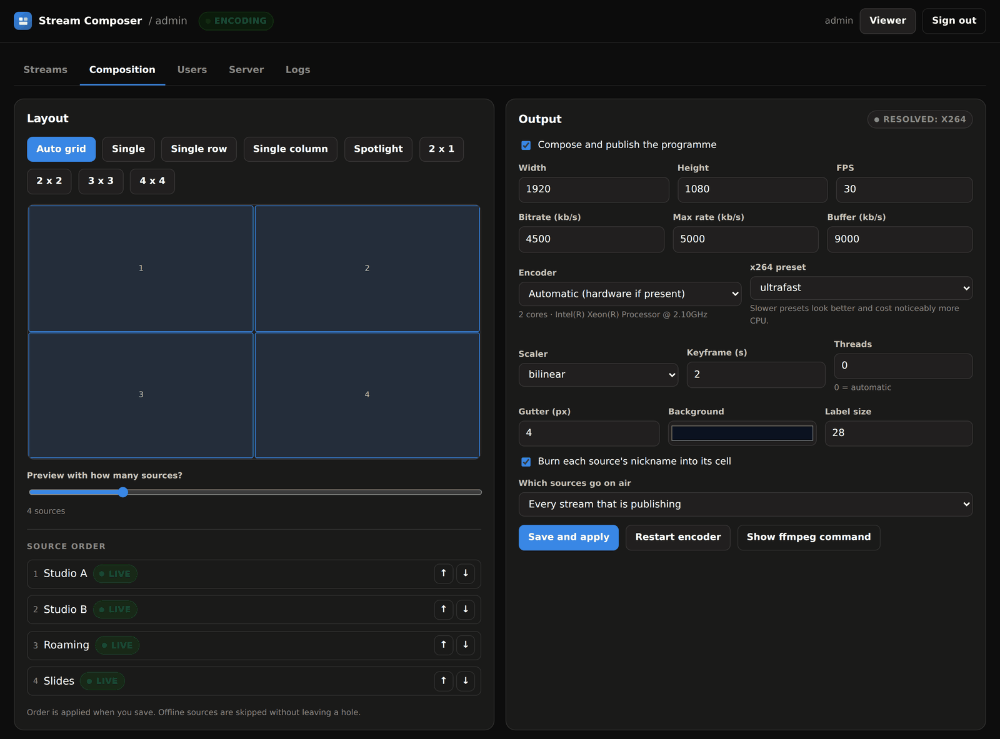
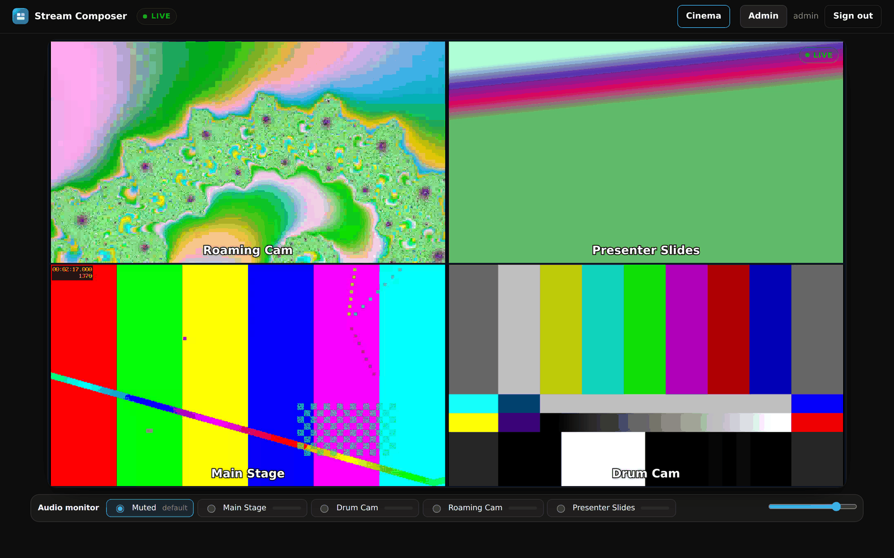

# Configuration

Two places hold settings:

- **`.env`** in the install directory — deployment facts: addresses, ports,
  secrets, image versions. Changing these needs `docker compose up -d`.
- **The admin console** — everything operational: streams, users, layout,
  bitrate, logging. Changes apply immediately.

---

## `.env`

### Compose selection

| Variable | Default | What it does |
|---|---|---|
| `COMPOSE_FILE` | `docker-compose.yml:docker-compose.local.yml` | Which overlay to use. Swap `local` for `tls` to move to HTTPS. |
| `COMPOSE_PROJECT_NAME` | `stream-composer` | Names containers and volumes. Set explicitly so Compose v1 and v2 agree — v2 can read it from the file's `name:` key, v1 has no such key. |

### Running on Compose v1

The canonical files follow the Compose Specification: no `version:` key, and a
top-level `name:`. The old standalone `docker-compose` (v1, end of life July
2023) reads a version-less file as the 2015 schema, where every top-level key is
a service name, and fails with the memorable
`'name' does not match any of the regexes: '^x-'`.

There is a generated fallback for that case:

| Instead of | Use |
|---|---|
| `docker-compose.yml:docker-compose.local.yml` | `docker-compose.v1.yml:docker-compose.v1.local.yml` |
| `docker-compose.yml:docker-compose.tls.yml` | `docker-compose.v1.yml:docker-compose.v1.tls.yml` |

The installer selects these automatically when it finds only v1. To switch by
hand, change `COMPOSE_FILE` in `.env`.

The fallback is **generated, not hand-maintained** — `scripts/make-compat.py`
produces it from the canonical files by adding `version: "3.7"` and dropping
`name:`, and nothing else. Two CI jobs keep it honest: one fails if the
committed output is stale, the other runs a real Compose v1.29.2 and compares
the resolved services, images, ports, environment and volumes against what
Compose v2 resolves from the canonical files. So it cannot silently drift.

To change anything, edit the canonical file and run:

```bash
make compat        # regenerate
make compat-check  # verify it is current and equivalent
```

`docker-compose.build.yml` has no v1 counterpart: building from source is a
development path, and development should use v2.

### Versions

| Variable | Default | |
|---|---|---|
| `COMPOSER_IMAGE` | `ghcr.io/slicit/stream-composer` | Image repository |
| `COMPOSER_TAG` | `latest` | Pin to a version for reproducible deployments |
| `MEDIAMTX_VERSION` | `1.19.1` | |
| `TRAEFIK_VERSION` | `v3.7` | TLS overlay only. **Must be 3.6.1 or newer** — older builds ask the Docker daemon for API 1.24, which Docker Engine 29 refuses. See [TROUBLESHOOTING.md](TROUBLESHOOTING.md). |

### Secrets

| Variable | | |
|---|---|---|
| `SESSION_SECRET` | required | Signs session cookies. Changing it signs everyone out. |
| `INTERNAL_SECRET` | required | Credential the compositor uses against MediaMTX. Never leaves the internal network. |

Generate both with `openssl rand -hex 32`. The installer does this for you and
keeps them across upgrades.

### First administrator

| Variable | Default | |
|---|---|---|
| `ADMIN_USER` | `admin` | |
| `ADMIN_PASSWORD` | *(empty)* | Used only when no users exist. Left empty, a random password is printed to the container log once — `docker compose logs composer`. |

After the first start these are ignored; manage accounts in the admin console.

### Addressing

| Variable | | |
|---|---|---|
| `PUBLIC_HOST` | Hostname or IP that OBS and viewers use. **Required for WebRTC to work from anywhere other than the server itself** — it becomes the advertised ICE candidate. |
| `DOMAIN` | TLS overlay: the certificate hostname. |
| `ACME_EMAIL` | TLS overlay: contact address for Let's Encrypt. |
| `PUBLIC_URL` | Set automatically by the TLS overlay; used to build the URLs shown in the OBS dialog. |

### Ports

| Variable | Default | |
|---|---|---|
| `HTTP_PORT` | `8080` | Web interface (plain-HTTP installs only) |
| `RTMP_PORT` | `1935` | RTMP ingest |
| `RTMPS_PORT` | `1936` | RTMPS ingest (TLS overlay) |
| `SRT_PORT` | `8890` | SRT ingest, UDP |
| `WEBRTC_UDP_PORT` | `8189` | WebRTC media, UDP — must be open for playback |
| `MEDIAMTX_RTSP_PORT` | `8554` | The stack's internal transport: the compositor reads its sources and publishes the programme over it. Never exposed. Only needs changing if you run MediaMTX outside the supplied Compose file on a non-default port. |

### Logging

| Variable | Default | |
|---|---|---|
| `LOG_LEVEL` | `info` | `error`, `warn`, `info`, `debug` |
| `LOG_MAX_SIZE_MB` | `20` | Rotate a log file at this size |
| `LOG_MAX_FILES` | `5` | Generations kept — worst case is size × files per channel |
| `DOCKER_LOG_MAX_SIZE` | `10m` | Docker's own capture of container stdout |
| `DOCKER_LOG_MAX_FILES` | `3` | |

### Encoding

| Variable | Default | |
|---|---|---|
| `ENCODER` | *(empty)* | Force `x264`, `vaapi`, `nvenc` or `qsv`. Empty means automatic. Overrides the admin console setting. |
| `TRUST_PROXY` | *(off)* | Number of reverse-proxy hops in front. The TLS overlay sets `1` for Traefik. Leave it off when the service is reached directly: trusting `X-Forwarded-For` otherwise lets a client forge its own address and bypass the sign-in throttle. |
| `TZ` | `UTC` | Timestamps in logs and the UI |

## Admin console

### Streams


Each stream is a name plus a key. The key is the credential OBS uses, so treat it
like a password — the table masks it until clicked.

Each stream also has a **nickname**: the caption burnt into the bottom-centre of
its cell, in white with a black outline so it stays legible over any picture.
Edit it in place in the Streams table; it saves when you leave the field or press
Enter, and the grid rebuilds within a couple of seconds.

The nickname is separate from the name on purpose. The name identifies the slot
to whoever runs the server ("Backstage laptop"); the nickname is what the
audience reads ("Green Room"). Leave it empty and the name is used, so nothing
changes for installs that never touch it. Viewers see the nickname too, in the
source list and the audio monitor, so the page and the picture always agree.

Captions can be switched off entirely with **Burn each source's nickname into
its cell** under Composition, and their size set with **Label size**.

- **OBS** shows the exact server URL and key, with copy buttons, for RTMP, RTMPS
  and SRT.
- **Disable** stops a stream being published without deleting it. An active
  publisher is disconnected immediately.
- **New key** rotates the key and disconnects whoever was using the old one.

### Restream



Forwards an incoming source on to another platform, exactly as it arrived. This
is separate from composition: the grid is for people watching *here*, and a
destination carries one source, untouched, to somebody else's service.

One source can have as many destinations as you like, and each is switched on
and off on its own without disturbing the others.

| Field | Notes |
|---|---|
| **Source** | Which incoming stream to forward. |
| **Where to** | `Twitch`, `YouTube Live`, `YouTube Live (backup ingest)` or `Custom RTMP`. Picking one fills in its ingest URL; the URL stays editable, because ingest hostnames are regional. |
| **Server URL** | Must be `rtmp://` or `rtmps://`. Use `rtmps://a.rtmps.youtube.com/live2` if outbound 1935 is blocked — it runs on 443. |
| **Stream key** | Appended as the final path segment. Twitch: Creator Dashboard → Settings → Stream. YouTube: Studio → Go live → Stream settings. Leave it empty if the whole address is already in the URL. |
| **Name** | What the table calls it. Defaults to the platform name. |
| **Audio** | *Pass through* copies the audio, which is what you want: RTMP carries AAC and so does OBS. *Re-encode to AAC* is for a source arriving as something else, and is the only transcode on this path. |

Nothing is re-encoded, so a destination costs a socket rather than a core —
adding platforms is a bandwidth question, not a CPU one.

**Status** tells you where a destination is:

| | |
|---|---|
| **Waiting for the source** | Configured and switched on, but the source is not publishing. It starts on its own when OBS connects. |
| **Connecting** | ffmpeg is up; no bytes have reached the platform yet. |
| **Forwarding** | Carrying. The *For*, *Rate* and *Sent* columns are measured on the outgoing socket. |
| **Retrying in Ns** | The last attempt failed; the message underneath is the last thing ffmpeg said. The wait doubles on each failure, so a wrong stream key does not spawn a process every two seconds. |
| **Off** | Switched off by hand. |

**New key** replaces the key; **Command** shows the exact ffmpeg carrying that
destination with the key removed, for a bug report. Deleting a stream deletes its
destinations too — otherwise it would keep publishing on behalf of an ingest slot
that now belongs to someone else.

Destinations are stored in `/data/config.json` alongside users and stream keys,
so they survive `docker compose pull && docker compose up -d`, a reboot and a
restore from `make backup`.

Restreaming works whether the grid is made on the server or in the browser: it
forwards the sources, not the programme.

### Composition



| Setting | Notes |
|---|---|
| **Where the grid is made** | *On the server* — ffmpeg composes one programme; every viewer gets one stream and HLS works. *In the browser* — no encoder runs at all; each viewer receives the sources and their browser arranges them into the same layout. See [ARCHITECTURE.md](ARCHITECTURE.md#where-the-grid-is-made) for the trade-off. |
| **When a source cannot be played over WebRTC** | Web composition only. *HLS* plays that source over HLS instead — no change at the publisher, no server cost, a couple of seconds behind, badged in the player. *Warn* leaves the cell empty with an explanation. Caused by H.264 with B-frames; see [OBS.md](OBS.md#b-frames-turn-them-off). |
| **Compose and publish** | Off stops the encoder entirely. Sources keep arriving and individual previews keep working. |
| **Layout** | `Auto` adapts to the source count. Fixed grids keep their shape and drop anything that does not fit. `Spotlight` gives the first source a large cell. |
| **Width / height / FPS** | Odd values are rounded down to even — H.264 requires it. |
| **Bitrate / max rate / buffer** | CBR-ish. Max rate is raised to the bitrate if set lower; buffer to twice the max rate. |
| **Encoder** | Unavailable options are greyed out with the reason. |
| **x264 preset** | `ultrafast` is right for live. See [PERFORMANCE.md](PERFORMANCE.md). |
| **Scaler** | `bilinear` by default. `lanczos` is sharp and expensive. |
| **Keyframe interval** | 2 s suits both HLS segmenting and quick joins. |
| **Threads** | 0 lets ffmpeg decide, which is almost always best. |
| **Gutter, background, labels** | Cosmetic. Labels cost 1–2% CPU per source. |
| **Which sources go on air** | *Every stream publishing* takes them all. *Only the sources I list* uses the order list and ignores the rest. |
| **Source order** | Cell order. Offline sources are skipped without leaving a gap. |

**Show ffmpeg command** prints the exact command line for the current
configuration — useful for a bug report, or for reproducing the pipeline by hand.

### The viewer's own settings

The picture is the whole page — every control (play/pause, stats, the audio
picker, mute, volume, full screen) lives in the player overlay, which appears
on hover. The one thing each viewer chooses for themselves is **which source
to listen to** — everything starts muted, by design.



### Users


Three roles:

- **Viewer** — the player page only.
- **Streamer** — the player page, plus self-service stream and restream
  management at `/streamer` (see [ARCHITECTURE.md](ARCHITECTURE.md#streamer-role)):
  register up to a quota an administrator sets, manage each stream's key and
  private/public visibility, and forward their own streams to other
  platforms. Created by an administrator, same as any other account.
- **Administrator** — everything.

The last administrator cannot be demoted or deleted.

### Server settings


| Setting | Notes |
|---|---|
| **Site name** | Shown in the header and the page title. |
| **Let anyone watch without signing in** | Public viewing. Administration stays locked. |
| **Show individual sources to viewers** | Off leaves only the composed programme; per-source previews are refused at the proxy, not just hidden. Has no effect when the grid is made in the browser — there the sources *are* the programme. |
| **Settle delay** | How long to wait after a source appears or disappears before rebuilding. Raise it on flaky networks. |
| **Restart delay / max restart delay** | Backoff bounds after an unexpected encoder exit. |
| **Log level, rotate at, keep files** | Applied immediately. The hint shows the worst-case disk use. |

## Changing where it lives

To move from plain HTTP to a domain with HTTPS, edit `.env`:

```ini
COMPOSE_FILE=docker-compose.yml:docker-compose.tls.yml
DOMAIN=stream.example.com
ACME_EMAIL=you@example.com
PUBLIC_HOST=stream.example.com
```

then `docker compose down && docker compose up -d`. Point the DNS record at the
server first, and open ports 80, 443 and 1936. Users, streams and settings are in
the volume and survive untouched.

## Backup and restore

Everything that matters is `/data/config.json` inside the `sc-composer-data`
volume.

```bash
make backup                                    # writes backups/stream-composer-<date>.tar.gz

# restore
docker compose stop composer
docker run --rm -v sc-composer-data:/data -v "$PWD/backups:/backup" alpine \
  sh -c 'cd /data && tar xzf /backup/stream-composer-<date>.tar.gz'
docker compose start composer
```

Keep `.env` alongside the backup — it holds the secrets that sessions and the
internal MediaMTX credential depend on.
