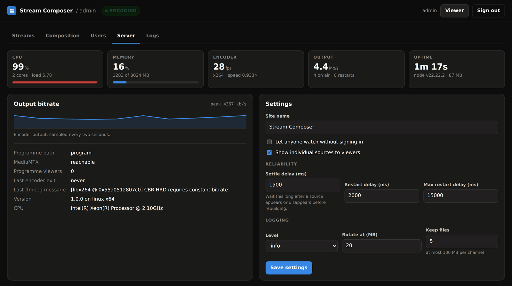
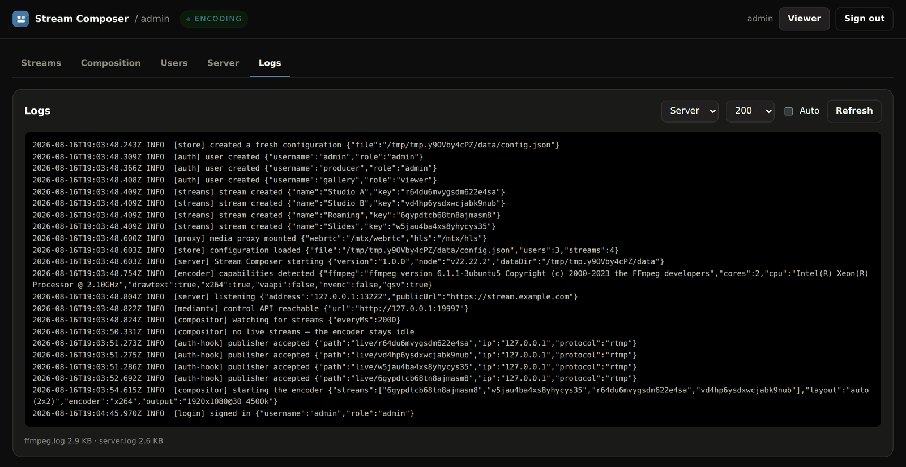

# Troubleshooting

Start here: **Admin → Server** shows whether MediaMTX is reachable, whether the
encoder is running, the last ffmpeg message and the restart count.
**Admin → Logs** has both channels, with `ffmpeg` carrying the exact command line
for every run.





```bash
cd /opt/stream-composer
docker compose ps
docker compose logs -f --tail=100
curl -s localhost:8080/healthz    # or https://your-domain/healthz
```

---

## OBS will not connect

**"Failed to connect to server"**

The RTMP port is not reachable. From another machine:

```bash
nc -vz your-server 1935
```

If that fails, open 1935/tcp in the firewall and any cloud security group. Check
the server URL is `rtmp://host/live` — including `/live`, and with no trailing
slash.

**Connects, then drops immediately**

The key was refused. Look in **Admin → Logs** for a `denied` line; the reason is
in it:

| Reason | Fix |
|---|---|
| `unknown stream key` | The key does not exist. Copy it again from the OBS dialog. |
| `stream is disabled` | Enable it in Admin → Streams. |
| `publish to "live/<stream key>"` | The server URL is missing `/live`, or the key ended up in the URL. |
| `the program path is written by the compositor only` | Something is publishing to `program`. Use a stream key. |

## Compose errors about `name` or a "wrong Compose file version"

```
The Compose file './docker-compose.yml' is invalid because:
'name' does not match any of the regexes: '^x-'
```

That is Compose v1 reading files written to the Compose Specification. Either
install v2 (recommended — v1 has been end of life since July 2023):

```bash
sudo apt-get install -y docker-compose-plugin
```

or switch `.env` to the generated v1 fallback, which describes the same stack:

```ini
COMPOSE_FILE=docker-compose.v1.yml:docker-compose.v1.local.yml
```

See [CONFIGURATION.md](CONFIGURATION.md#running-on-compose-v1).

## `docker compose` prints Docker's help, or "unknown shorthand flag: 'd'"

Docker does not recognise `compose` as a command, which almost always means the
v2 plugin is installed for your user under `~/.docker/cli-plugins/` but you are
running as root through `sudo`. Install it system-wide:

```bash
sudo apt-get install -y docker-compose-plugin
```

or copy it where root can see it:

```bash
sudo mkdir -p /usr/local/lib/docker/cli-plugins
sudo cp ~/.docker/cli-plugins/docker-compose /usr/local/lib/docker/cli-plugins/
```

## Publishing, but not in the grid

- Give it two seconds — the composer waits for the source set to settle.
- Check **Compose and publish** is on in Admin → Composition.
- If source selection is *manual*, the key has to be in the order list.
- With a fixed layout (`2x2`, `3x3`), anything beyond capacity is dropped. The
  layout preview warns when sources would not fit.
- Check **Admin → Logs → ffmpeg** for an input error on that source.

## The player shows "Connecting" and never starts

Almost always WebRTC media cannot get through.

1. **`PUBLIC_HOST` must be set** to the address viewers use. Without it MediaMTX
   advertises only container-internal addresses, and no browser outside the host
   can connect. Check with `grep PUBLIC_HOST .env`, then
   `docker compose up -d` after changing it.
2. **UDP 8189 must be open** inbound. This one is easy to miss because everything
   else works over TCP:
   ```bash
   nc -vzu your-server 8189
   ```
3. **Try the HLS button** in the player sidebar. If HLS works and WebRTC does
   not, it is certainly the UDP path. HLS is a fine fallback — a few seconds of
   latency instead of under one.
4. Some corporate networks block UDP entirely. HLS is the answer there; a TURN
   server would also work but is out of scope here.

## "This browser cannot play the stream"

The browser has no H.264 decoder, and every stream here is H.264. This is rare
but real: some Linux builds of Chromium and Firefox ship without it for patent
reasons.

Use Chrome, Edge or Safari, or install the H.264-enabled build for your
distribution (`chromium-codecs-ffmpeg-extra` on Debian and Ubuntu). Switching to
HLS does not help — it carries the same codec.

## Playback stutters or drops frames

Check **Admin → Server → Encoder**. Speed below 1.0× means the machine cannot
keep up. In order of effect:

1. Lower the output resolution (1080p → 720p saves ~45%).
2. Lower the frame rate (30 → 25 fps saves ~17%).
3. Ask publishers to send 720p rather than 1080p.
4. Enable hardware encoding if the machine has a GPU.

Run `./scripts/benchmark.sh` for a measured verdict on the hardware. Details in
[PERFORMANCE.md](PERFORMANCE.md).

## The encoder keeps restarting

A climbing restart count means sources are appearing and disappearing.

- **Admin → Logs → ffmpeg** shows which input failed.
- Raise **Settle delay** (Admin → Server → Settings) to 3000–5000 ms so brief
  dropouts do not trigger a rebuild.
- A publisher on a poor connection is the usual cause; SRT ingest handles loss far
  better than RTMP.

## Certificates are not issued

With the TLS overlay:

```bash
docker compose logs traefik | grep -i acme
```

| Symptom | Cause |
|---|---|
| `unable to generate a certificate` with a DNS error | `DOMAIN` does not resolve to this server yet |
| Connection refused on the challenge | Port 80 is not open inbound — the HTTP-01 challenge needs it even though everything redirects to HTTPS |
| `too many certificates already issued` | Let's Encrypt rate limit. Uncomment the staging `caserver` line in `docker-compose.tls.yml` while testing. |

The first page load after issuance can take a few seconds.

## I cannot sign in

**Forgotten administrator password.** Reset it by hand: stop the service, edit the
users out of the config, and let the bootstrap run again.

```bash
docker compose stop composer
docker run --rm -v sc-composer-data:/data alpine \
  sh -c 'cd /data && cp config.json config.json.bak &&
         sed -i "s/\"users\": \[[^]]*\]/\"users\": []/" config.json'
# set ADMIN_PASSWORD in .env, then:
docker compose up -d composer
```

The next start recreates the administrator from `ADMIN_USER` / `ADMIN_PASSWORD`.
Streams and settings are untouched, other user accounts are not.

**Signed out constantly.** `SESSION_SECRET` is changing between restarts — make
sure it is set to a fixed value in `.env`.

## "The media server is not responding"

The composer cannot reach MediaMTX.

```bash
docker compose ps mediamtx
docker compose logs mediamtx | tail -30
```

A YAML error in `config/mediamtx.yml` stops it starting. If you have pinned a
newer `MEDIAMTX_VERSION`, a configuration key may have been renamed upstream —
the log names the offending key. The shipped config deliberately sets only what
is needed, so this is rare.

## Disk filling up

Two separate log stores:

- Application logs in the volume — bounded by **rotate at × keep files** in
  Admin → Server → Settings. Default worst case is 100 MB per channel.
- Docker's capture of container stdout — bounded by `DOCKER_LOG_MAX_SIZE` and
  `DOCKER_LOG_MAX_FILES` in `.env`. These apply on container recreation, so run
  `docker compose up -d --force-recreate` after changing them.

Check current usage:

```bash
docker compose exec composer du -sh /data/logs
docker system df
```

## Starting over

```bash
cd /opt/stream-composer
docker compose down -v      # -v also deletes users, streams and certificates
docker compose up -d
```

Take a backup first if there is anything worth keeping — `make backup`.

## Reporting a bug

Useful to include:

```bash
docker compose ps
docker compose logs --tail=100 composer
curl -s localhost:8080/healthz
```

plus **Admin → Composition → Show ffmpeg command** and the output of
`./scripts/benchmark.sh --counts 4 --duration 10`. Together those pin down almost
anything.
